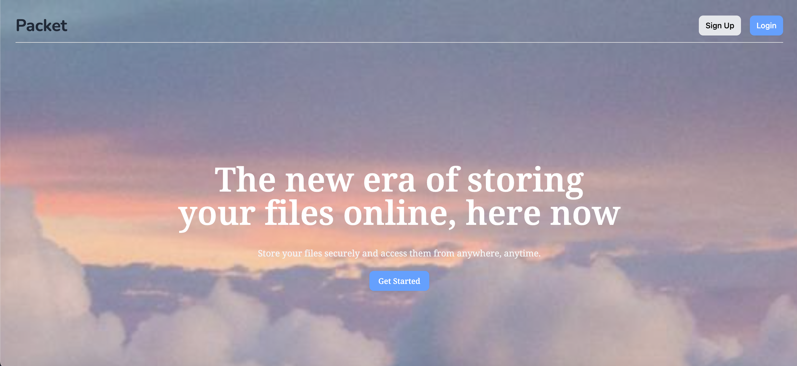

# File-Uploader

A file uploader full stack application similar to how Google Drive works



## Information

An application where users can upload files, organize them by creating their own folders, and also download files that they uploaded

## Tools Used

- React + Vite
- Tailwind CSS
- HTML5
- TypeScript
- Node.js
- Express.js
- PostgreSQL & Prisma
- Supabase

## Getting Started

```
git clone https://github.com/AndrewC145/File-Uploader.git

cd File-Uploader

cd client
cd server

npm install

npm run dev
```
